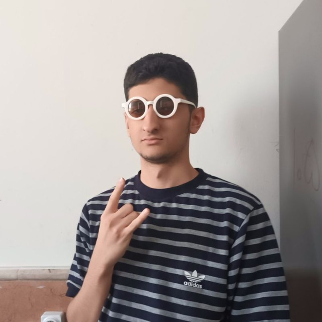

# 🚀 About Me:
### Hello! I'm **Mahyar**, a 17-year-old **Unreal Engine** game developer who started this journey at 12.

I have spent two years working with Unity and am currently using Unreal
Engine. I am passionate about game development and committed to
excelling in this field. Additionally, I have built applications using the Flutter
framework and have some experience in robotics. I plan to move to
Mahyar Kazazi
Germany or the Netherlands for their excellent opportunities in game
development and technology. Highly motivated, persistent, and always
eager to learn and improve. If you're interested in collaborating or
discussing potential opportunities, feel free to reach out!

#### My Resume:

## 💻 Skills:
### Game Development Skills:

### Management Skills:

### Other

 

## 🌐 Socials:

  
 

## 📊 GitHub Stats:

